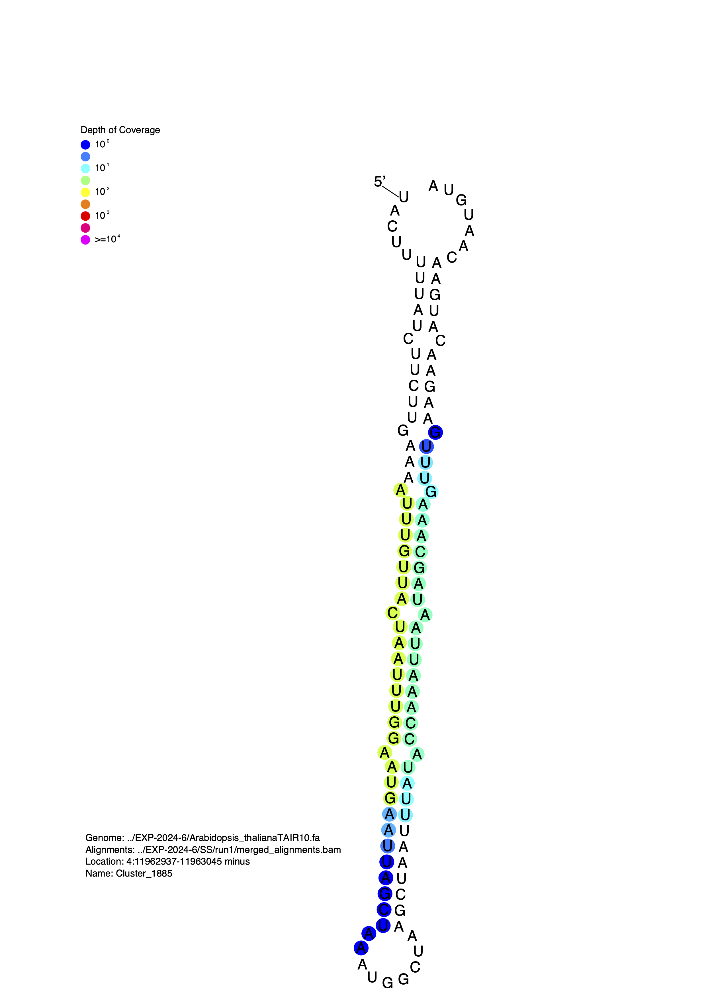

[](http://bioconda.github.io/recipes/strucvis/README.html) 

# LICENSE
strucVis : Display small RNA depth of coverage on a predicted RNA
    secondary structure

Copyright (C) 2016-2026 Michael J. Axtell

This program is free software: you can redistribute it and/or modify it
    under the terms of the GNU General Public License as published by the
    Free Software Foundation, either version 3 of the License, or (at your
    option) any later version.

This program is distributed in the hope that it will be useful,
        but WITHOUT ANY WARRANTY; without even the implied warranty of
        MERCHANTABILITY or FITNESS FOR A PARTICULAR PURPOSE.  See the
        GNU General Public License for more details.

You should have received a copy of the GNU General Public License
        along with this program.  If not, see <http://www.gnu.org/licenses/>.

AUTHOR
    Michael J. Axtell, Penn State University mja18@psu.edu

REQUIREMENTS
- perl5 (available at /usr/bin/env perl)
- samtools (installed in your PATH)
- RNAfold (installed in your PATH)
- ps2pdf (installed in your PATH .. this is part of the ghostscript package)

# Install using pixi and bioconda

1. Ensure pixi is installed on your device. <https://pixi.prefix.dev/latest/installation/>
2. Configure pixi to use channels conda-forge and bioconda `pixi config set default-channels '["conda-forge", "bioconda"]'` <https://bioconda.github.io>
3. For a global installation: `pixi global install strucvis`
4. Or, for an environment in a specific directory: 
```
cd myproject
pixi init
pixi add strucvis
```

USAGE

`strucVis [-xvh] -b bam -g genome -c Chr:start-stop -s strand -p image_output [-n Locus name -m range(s)]`

INPUTS
```
    -b : path to sorted and indexed BAM alignment file of small RNAs

    -g : path to FASTA formatted reference genome. Must be indexed using
    samtools faidx.

    -c : Coordinates of interest in format Chr:start-stop.

    -s : Strand of interest. Either 'plus' or 'minus'.

    -p : Output pdf file name. Omit the .pdf suffix, it will be added for you.

    -n : Name of locus. Prints name in the pdf file and on the plain text
    alignments. If not provided, defaults to 'Unnamed Locus'

    -m : One or more ranges to highlight. In format start-stop. Multiple ranges can be separated by commas. For instance, 20-40,90-110.


SWITCHES
    -x : Suppress the printing of detailed file information on the
    post-script file

    -v : Print the version and quit

    -h : Print help message and quit
```

OUTPUT

- A pdf image showing the predicted RNA secondary structure with each nucleotide color-coded to represent the depth of sRNA alignments. 
- A plain-text file showing the predicted RNA secondary structure using dot-bracket notation, with sRNA alignments shown underneath.

```
Genome: ../EXP-2024-6/Arabidopsis_thalianaTAIR10.fa
Alignments: ../EXP-2024-6/SS/run1/merged_alignments.bam
Location: 4:11962937-11963045 minus
PDF file name: ShortStack_1716486683/strucVis/Cluster_1885.ps.pdf
Locus Name: Cluster_1885
UACUUUUUAUCUUCUUGAAAAUUUGUUACUAAUUUGGAAUGAAUUAGCUAAAUGGCUAAGCUAAUUUAUACCAAAUUAAUAGCAAAGUUUGAAGAACAUGAACAAUGUA
.....(((((.(((((.(((.(((((((.((((((((.(((((((((((.........))))))))))).)))))))).))))))).))).))))).)))))....... (-34.50)
....................AUUUGUUACUAAUUUGGAAUG.................................................................... len:21 al:47
....................AUUUGUUACUAAUUUGGAAUGAA.................................................................. len:23 al:1
....................AUUUGUUACUAAUUUGGAAUGAAU................................................................. len:24 al:2
....................AUUUGUUACUAAUUUGGAA...................................................................... len:19 al:1
....................AUUUGUUACUAAUUUGGAAUa.................................................................... len:21 al:1
....................AUUUGUUACUAAUU........................................................................... len:14 al:3
....................AUUUGUUACUAAUUUGGAAUu.................................................................... len:21 al:2
....................AUUUGUUACUAAUUUGuAAUG.................................................................... len:21 al:1
....................AUUUGUUACUAAUUUGGAAUGAu.................................................................. len:23 al:1
......................UUGUUACUAAUUUGGAAUG.................................................................... len:19 al:1
.......................................UGAAUUAGCUAA.......................................................... len:12 al:1
.................................................................UUAUACCAAAUUAAUAGC.......................... len:18 al:1
.................................................................UUAUACCAAAUUAAUAGCu......................... len:19 al:2
.................................................................UUAUACCAAAUUAAUAGCAu........................ len:20 al:1
.................................................................UUAUACCAAAUUAAUAGCAAAaUUU................... len:25 al:1
.................................................................UUAUACCAAAUUAAUAGCAAu....................... len:21 al:1
.................................................................UUAUACCAAAUUAAUAGCAAA....................... len:21 al:3
..................................................................UAUACCAAAUUAAUAGCAAAG...................... len:21 al:1
....................................................................UACCAAAUUAAUAGCAAAGUU.................... len:21 al:6
....................................................................UACCAAAUUAAUAGCAAAGU..................... len:20 al:1
......................................................................CCAAAUUAAUAGCAAAGUUUG.................. len:21 al:1
```


